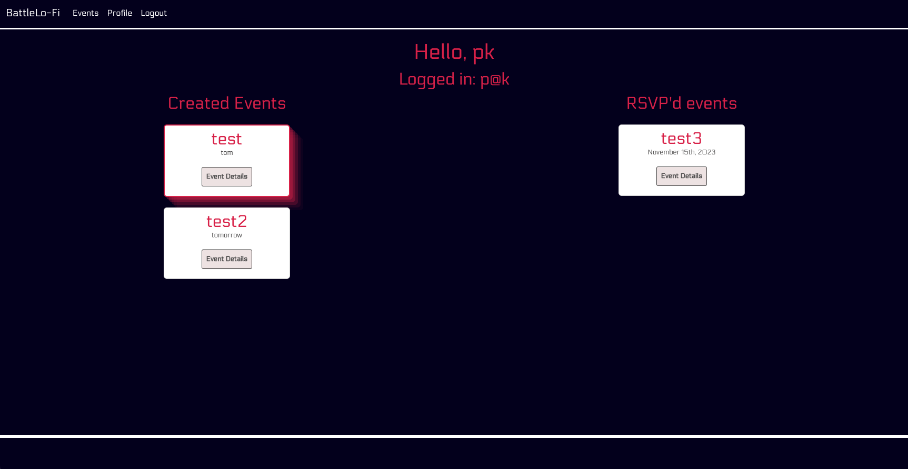
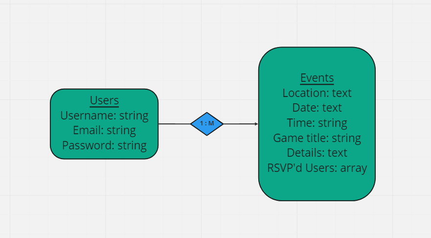
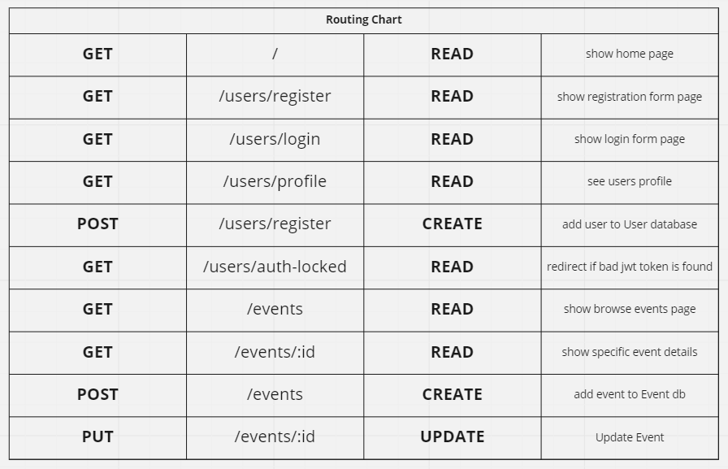
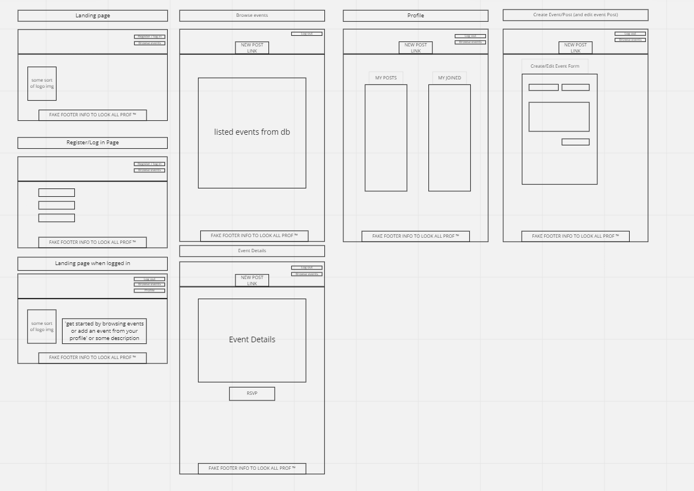

# BattleLo-Fi

## [BattleLo-Fi](https://battlelofi.netlify.app)

## Project Idea and Descriptions
* Welcome to BattleLo-Fi, where you and your mates will never miss out on the next gaming session. Plan, organize and keep in touch with what, where and when. Keep it casual when and set up parties, or step it up and put together a friendly tournament. 

## Technologies
* HTML/CSS
* JavaScript: Node and Express
* React
* MongoDB
* bcrypt and jsonwebtoken for auth
* Bootstrap, Material Design, uiverse

## Installation Instructions
1. To run this app locally, fork and clone this repo and the server repo.
2. In your terminal, go to the locally-cloned repository and run npm i
3. Check to see if node_modules is in the .gitignore file on both the forked client and server repos. If not, run the commands `echo node_modules >> .gitignore` and `echo .env >> .gitignore`.
4. In your forked Client repo, run `touch .env.local` and paste in `REACT_APP_SERVER_URL=http://localhost:8000`
5. Afterwards, in your forked Server repo, in your terminal run `touch .env` and add `JWT_SECRET='[insert your secret]'`
6. In your terminal for the Client, run `npm start`. In your terminal for server, run `nodemon`

## General Approach
* The general approach we took was different than any of the previous projects we had worked on. As this was our first "group project" we had to coordinate and get accustomed to working with others in the git project workflow. We decided we would first work through the backend together, that way we could understand the api we are building (routes, models, relationships, etc.). We then distributed work based on pages, mostly to avoid merge conflicts on github, but also based on what we were interested in tackling. Once we finished the mvp functionality (later than originially expected due to unforseen circumstances) we then thought to distribute css work by pages as well, while keeping in very close communication since we were working on the same file. I believe through our consistent checkins with eachother, we were able to create a functional event app with nice styling.

## Website Preview

## ERDs

## Restful Routing Chart

## Wireframes

## User Stories
* As a new user, I would like to be able to see all events
* As a new user, I would like to be able to create an account 
* As a user, I would like to be able to log in
* As a user, I would like to be able to see all events/posts
* As a user, I would like to be able to RSVP to an event
* As a user, I would like to be able to add a comment under a specific event
* As a user, I would like to be able to Post an event
* As a user, I would like to be able to Update(Edit) my event
* As a user, I would like to be able to Delete my event
* As a user, if I’m signed in, I would like to be able to log out

## MVP
1. Allow users to register for an account with username, email and password
2. Allow users to log in with email and password, as well as sign out
3. Allow all users(registered or not) to see (get) all events as well as specific event details
4. Allow signed in user to create, update, and delete their own events
5. Allow signed in users to RSVP to events

## Stretch Goals
1. Allow users to send messages to all RSVP’d users for their created event
2. Allow users to receive a notification for reminder of events
3. Allow users to search events by game title (hitting igdb api for images and title names?)
4. Allow users to host different types of events (tournaments, casual gaming, etc.)
5. Allow signed in users to comment on events

## Unsolved Problems/Hurdles
1. We did not get to our stretch goals, but we are excited about the potential this app has.
2. We suddenly lost a member of our group early on in the project, which took some redistribution of work and a longer time to reach MVP.

